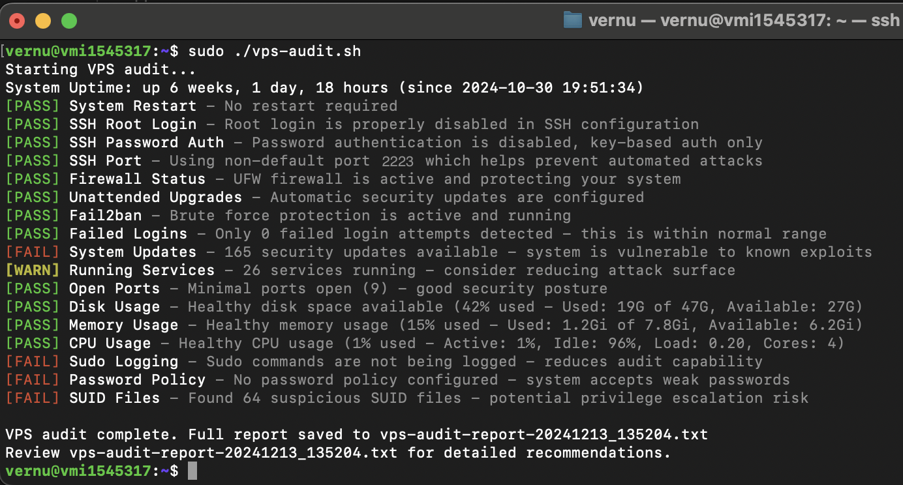

# VPS Security Audit Script

A comprehensive Bash script for auditing the security and performance of your VPS (Virtual Private Server). This tool performs various security checks and provides a detailed report with recommendations for improvements.

<!-- add a screenshot of the output here -->


## Features

### Security Checks

- SSH Configuration
  - Root login status
  - Password authentication
  - Non-default port usage
- Firewall Status (UFW)
- Fail2ban Configuration
- Failed Login Attempts
- System Updates Status
- Running Services Analysis
- Open Ports Detection
- Sudo Logging Configuration
- Password Policy Enforcement
- SUID Files Detection

### Performance Monitoring

- Disk Space Usage
- Memory Usage
- CPU Usage
- Active Internet Connections

## Requirements

- Ubuntu/Debian-based Linux system
- Root access or sudo privileges
- Basic packages (most are pre-installed):
  - ufw
  - systemd
  - netstat
  - grep
  - awk

## Installation

1. Download the script:

```bash
wget https://raw.githubusercontent.com/vernu/vps-audit/main/vps-audit.sh
# or
curl -O https://raw.githubusercontent.com/vernu/vps-audit/main/vps-audit.sh
```

2. Make the script executable:

```bash
chmod +x vps-audit.sh
```

## Usage

Run the script with sudo privileges:

```bash
sudo ./vps-audit.sh
```

The script will:

1. Perform all security checks
2. Display results in real-time with color coding:
   - 🟢 [PASS] - Check passed successfully
   - 🟡 [WARN] - Potential issues detected
   - 🔴 [FAIL] - Critical issues found
3. Generate a detailed report file: `vps-audit-report-[TIMESTAMP].txt`

## Output Format

The script provides two types of output:

1. Real-time console output with color coding:

```
[PASS] SSH Root Login - Root login is properly disabled in SSH configuration
[WARN] SSH Port - Using default port 22 - consider changing to a non-standard port
[FAIL] Firewall Status - UFW firewall is not active - your system is exposed
```

2. A detailed report file containing:
   - All check results
   - Specific recommendations for failed checks
   - System resource usage statistics
   - Timestamp of the audit

## Thresholds

### Resource Usage Thresholds

- PASS: < 50% usage
- WARN: 50-80% usage
- FAIL: > 80% usage

### Security Thresholds

- Failed Logins:
  - PASS: < 10 attempts
  - WARN: 10-50 attempts
  - FAIL: > 50 attempts
- Running Services:
  - PASS: < 20 services
  - WARN: 20-40 services
  - FAIL: > 40 services
- Open Ports:
  - PASS: < 10 ports
  - WARN: 10-20 ports
  - FAIL: > 20 ports

## Customization

You can modify the thresholds by editing the following variables in the script:

- Resource usage thresholds
- Failed login attempt thresholds
- Service count thresholds
- Open port thresholds

## Best Practices

1. Run the audit regularly (e.g., weekly) to maintain security
2. Review the generated report thoroughly
3. Address any FAIL status immediately
4. Investigate WARN status during maintenance
5. Keep the script updated with your security policies

## Limitations

- Designed for Debian/Ubuntu-based systems
- Requires root/sudo access
- Some checks may need customization for specific environments
- Not a replacement for professional security audit

## Contributing

Feel free to submit issues and enhancement requests!

## License

This project is licensed under the MIT License - see the LICENSE file for details.

## Security Notice

While this script helps identify common security issues, it should not be your only security measure. Always:

- Keep your system updated
- Monitor logs regularly
- Follow security best practices
- Consider professional security audits for critical systems

## Support

For support, please:

1. Check the existing issues
2. Create a new issue with detailed information
3. Provide the output of the script and your system information

Stay secure! 🔒
