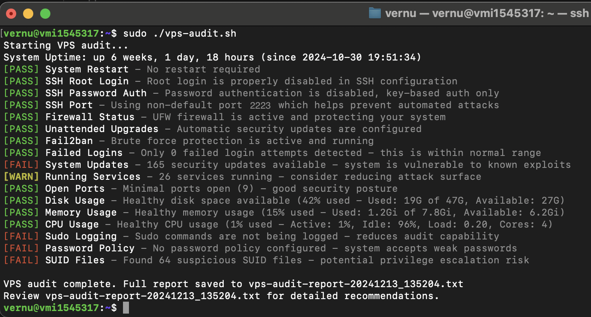

# VPS Security Audit Script

A comprehensive Bash script for auditing the security and performance of your VPS (Virtual Private Server). This tool performs various security checks and provides a detailed report with recommendations for improvements.

<!-- add a screenshot of the output here -->


## Features

### Security Checks

- **SSH Configuration**
  - Root login status
  - Password authentication
  - Non-default port usage
- **Firewall Status** (UFW/firewalld/iptables/nftables)
- **Intrusion Prevention** (Fail2ban/CrowdSec) Configuration
- **Failed Login Attempts**
- **System Updates Status**
- **Running Services** Analysis
- **Open Ports** Detection
- **Sudo Logging** Configuration
- **Password Policy** Enforcement (via `pwquality.conf`)
- **SUID Files** Detection

### Performance Monitoring

- Disk Space Usage
- Memory Usage
- CPU Usage
- Active Internet Connections

---

## Requirements

- Ubuntu/Debian-based Linux system
- **Root access** or `sudo` privileges
- Basic packages (most are pre-installed):
  - `ufw`
  - `systemd`
  - `netstat`/`ss`
  - `grep`
  - `awk`

---

## Installation

1. Download the script:

```bash
wget https://raw.githubusercontent.com/vernu/vps-audit/main/vps-audit.sh
# or
curl -O https://raw.githubusercontent.com/vernu/vps-audit/main/vps-audit.sh
```

2. Make the script executable:

```bash
chmod +x vps-audit.sh
```

---

## Usage

Run the script with `sudo` privileges:

```bash
sudo ./vps-audit.sh
```

The script will:

1. Perform all security checks
2. Display results in real-time with color coding:
   - 🟢 [PASS] - Check passed successfully
   - 🟡 [WARN] - Potential issues detected
   - 🔴 [FAIL] - Critical issues found
3. Generate a detailed report file: `vps-audit-report-[TIMESTAMP].txt`

## Output Format

The script provides two types of output:

1. Real-time console output with color coding:

```
[PASS] SSH Root Login - Root login is properly disabled in SSH configuration
[WARN] SSH Port - Using default port 22 - consider changing to a non-standard port
[FAIL] Firewall Status - UFW firewall is not active - your system is exposed
```

2. A detailed report file containing:
   - All check results
   - Specific recommendations for failed checks
   - System resource usage statistics
   - Timestamp of the audit

---

## Customization

The script's behavior, file paths, and scoring limits are fully controlled by variables defined in the **`Configuration`** section at the top of the script file.

### 1. Dynamic Thresholds for PASS/WARN/FAIL Status

These variables define the numerical limits that trigger a **WARN** or **FAIL** status.

| Variable | Default Value | Check | Description |
| :--- | :--- | :--- | :--- |
| `RESOURCE_WARN` | `50` | Resource Usage | **WARN** if Disk/Memory/CPU usage is between 50-80%. |
| `RESOURCE_FAIL` | `80` | Resource Usage | **FAIL** if Disk/Memory/CPU usage is more than 80%. |
| `SERVICES_WARN` | `20` | Running Services | **WARN** if between 20-40 services are running. |
| `SERVICES_FAIL` | `40` | Running Services | **FAIL** if more than 40 services are running. |
| `LOGINS_WARN` | `10` | Failed Logins | **WARN** if between 10-50 failed login attempts are detected. |
| `LOGINS_FAIL` | `50` | Failed Logins | **FAIL** if more than 50 failed login attempts are detected. |
| `OPEN_PORTS_WARN` | `10` | Open Ports | **WARN** if between 10-20 listening ports are found. |
| `OPEN_PORTS_FAIL` | `20` | Open Ports | **FAIL** if more than 20 listening ports are found. |
| `PASSWORD_MINLEN` | `12` | Password Policy | **PASS** if `minlen` in `pwquality.conf` is at least this value. |

### 2. Report Output and Ownership

These variables control where the report is saved and the file permissions.

| Variable | Default Value | Description |
| :--- | :--- | :--- |
| `DEFAULT_REPORT_DIR` | `.` *(The current directory)* | The directory where the report file will be saved. |
| `ENABLE_CHOWN` | `false` | If `true`, sets ownership of the report file and (if newly created) the report directory to `REPORT_CHOWN_OWNER`. |
| `REPORT_CHOWN_OWNER` | `${SUDO_USER:-$(id -un)}:<their group>` | The target `user:group` for `chown`. Defaults to the user who invoked `sudo`, so reports are not left owned by `root`. |
| `REPORT_FILENAME` | `vps-audit-report-$(TIMESTAMP).txt` | The template name for the generated report file. |

### 3. Security Check File Paths

You can adjust the paths the script uses to check critical configuration files:

| Variable | Default Value | Description |
| :--- | :--- | :--- |
| `OS_RELEASE_FILE` | `/etc/os-release` | Path to the Operating System release file. |
| `REBOOT_REQUIRED_FILE` | `/var/run/reboot-required` | File indicating a system restart is needed. |
| `SSH_CONFIG_FILE` | `/etc/ssh/sshd_config` | Main SSH daemon configuration file. |
| `AUTH_LOG_FILE` | `/var/log/auth.log` | Log file checked for failed login attempts. |
| `SUDOERS_FILE` | `/etc/sudoers` | File checked for sudo logging configuration. |
| `PASSWORD_QUALITY_CONF` | `/etc/security/pwquality.conf` | Password complexity policy configuration file. |

---

## Best Practices

1. Run the audit regularly (e.g., weekly) to maintain security
2. Review the generated report thoroughly
3. Address any **FAIL** status immediately
4. Investigate **WARN** status during maintenance
5. Keep the script updated with your security policies

## Limitations

- Designed for Debian/Ubuntu-based systems
- Requires root/sudo access
- Some checks may need customization for specific environments
- Not a replacement for professional security audit

## Contributing

Feel free to submit issues and enhancement requests!

## License

This project is licensed under the MIT License - see the LICENSE file for details.

## Security Notice

While this script helps identify common security issues, it should not be your only security measure. Always:

- Keep your system updated
- Monitor logs regularly
- Follow security best practices
- Consider professional security audits for critical systems

## Support

For support, please:

1. Check the existing issues
2. Create a new issue with detailed information
3. Provide the output of the script and your system information

Stay secure! 🔒
